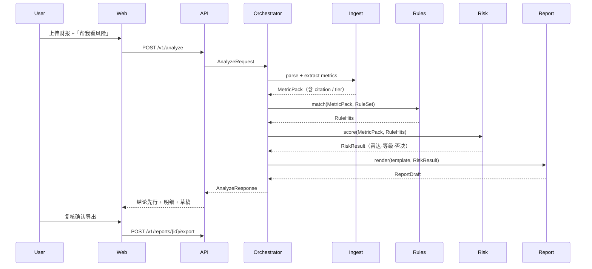

# 02 · 系统架构

> 对齐 PRD：`07_技术架构` · `04_信息架构与交互`  
> 竞赛/MVP 工程架构；商业闭环与行内集成不在本版范围。

---

## 1. 一句话

```
上传/对话 → Orchestrator → [Ingest → Rules → Risk → Report → Workflow]
                              ↑                         ↑
                     DataPlane（降级/质检/缓存）    content/（规则·模板·fixtures）
```

**准确性来自计算与规则；可读性来自模板与 LLM 文案；可演示性来自 fixtures + 降级。**

---

## 2. 系统全景

```
┌──────────────────────────────────────────────────────────────────────────┐
│ apps/web（Presentation · React 工作台 · ADR-005）                          │
│  Shell+分栏 · 工作台 · 企业空间 · 规则/报告 · Copilot · AnalyzeFSM         │
└────────────────────────────────┬─────────────────────────────────────────┘
                                 │ HTTP JSON
┌────────────────────────────────▼─────────────────────────────────────────┐
│ apps/api（FastAPI）                                                       │
│  /v1/companies · /v1/documents · /v1/analyze · /v1/rules · /v1/reports   │
│  /v1/workflows · /v1/chat · /v1/health                                    │
│  编排入口 · 超时 · 任务状态                                               │
└────────────────────────────────┬─────────────────────────────────────────┘
                                 │
┌────────────────────────────────▼─────────────────────────────────────────┐
│ packages/orchestrator（意图识别 · 任务图 · 阶段编排）                      │
│  Intent → Pipeline(Analyze) → HumanGate                                   │
└─────┬──────────┬──────────┬──────────┬──────────┬────────────────────────┘
      │          │          │          │          │
┌─────▼───┐ ┌────▼────┐ ┌───▼────┐ ┌───▼─────┐ ┌──▼────────┐
│ ingest  │ │  rules  │ │  risk  │ │ report  │ │ workflow  │
│ 解析抽取 │ │ 引擎匹配 │ │ 评分压力 │ │ 模板导出 │ │ 流程模板  │
└────┬────┘ └────┬────┘ └───┬────┘ └───┬─────┘ └──┬────────┘
     │           │          │          │          │
     └───────────┴────┬─────┴──────────┴──────────┘
                      │
         ┌────────────▼────────────┐     ┌─────────────────────┐
         │ packages/data           │     │ packages/rag · kg   │
         │ 源适配·降级·质检·SQLite │     │ 本地检索 · NetworkX │
         └────────────┬────────────┘     └─────────────────────┘
                      │
         ┌────────────▼────────────┐
         │ content/ + uploads/     │
         │ rules YAML · templates  │
         │ fixtures 三案例          │
         └─────────────────────────┘
```

---

## 3. 分层职责

| 层 | 负责 | 禁止 |
|---|---|---|
| Web | 交互、进度、展示雷达/报告、触发确认 | 持有数据源密钥业务逻辑；自行算风险分 |
| API | HTTP、鉴权占位、任务状态、调用编排 | 手写规则条件；直接拼报告段落 |
| Orchestrator | 意图→阶段调度、失败降级策略、人机闸门 | 解析 PDF 细节；渲染 Word |
| ingest | 文档解析、指标抽取、冲突标注、引用 | 规则评分；对外 HTTP 业务编排 |
| rules | 加载 YAML、匹配、NL→Schema、版本 | 改财务原始数；决定授信额度 |
| risk | 五维标准化、总分、等级、压力测试 | 调 LLM 编数字；读写任意表无契约 |
| report | 插槽装配、模板渲染、导出 | 重新计算指标（只消费 RiskResult） |
| workflow | 流程模板状态机、清单检查 | 替代 risk/report 核心逻辑 |
| data | 多源拉取、缓存、`_tier`、六维质检 | 业务文案；规则解释文案 |
| rag / kg | 切片检索、实体关系图 | 最终风险等级裁定 |

---

## 4. 运行模式（三种，可切换）

| 模式 | 何时用 | 数据路径 |
|---|---|---|
| **A. snapshot** | 答辩 / 无网 | 只读 `content/fixtures` + 本地上传解析 |
| **B. hybrid** | 日常开发默认 | SQLite 缓存优先 → Tushare/AKShare 按需 |
| **C. live** | 联调外部源 | 尽量 L1 API，失败仍降级到 L2/L3 |

环境变量：`BIZATLAS_MODE`。见 ADR-003。

---

## 5. 主序列（上传 → 研判 → 报告）



---

## 6. 与 PRD 五能力的映射

| PRD 能力 | 主包 | 协作包 |
|---|---|---|
| 资料理解 | ingest | rag, kg, data |
| 规则匹配 | rules | — |
| 风险提示 | risk | rules, kg |
| 投研整理 | report | risk（只读结果） |
| 流程辅助 | workflow | orchestrator |

编排层把五能力串成一条可演示闭环；各包保持可单测。

---

## 7. 关键设计原则（落地约束）

1. **能力与领域分离** — `risk` 内核吃「指标向量」；行业阈值在 `content/rules`。
2. **可解释优先** — `Evidence` 结构贯穿：value / formula / rule_id / source。
3. **人在回路** — `HumanGate`：export、规则生效（非 pilot）、流程提交。
4. **降级不阻塞** — 任一源失败不抛致命错；标注后继续。
5. **可插拔数据源** — `data.providers.*` 统一接口 `fetch(company_id, fields)`。

---

## 8. 非功能（MVP 目标）

| 指标 | 目标 |
|---|---|
| 单企业全流程 | < 5 分钟（含人工点击） |
| 解析+评分（无 LLM 文案） | < 60 秒（标准 PDF） |
| 关键指标准确率 | ≥ 90%（fixtures） |
| 可用性 | 无外部 API 时 snapshot 可完整演示 |

---

*下一步：[03-tech-stack.md](./03-tech-stack.md)*
